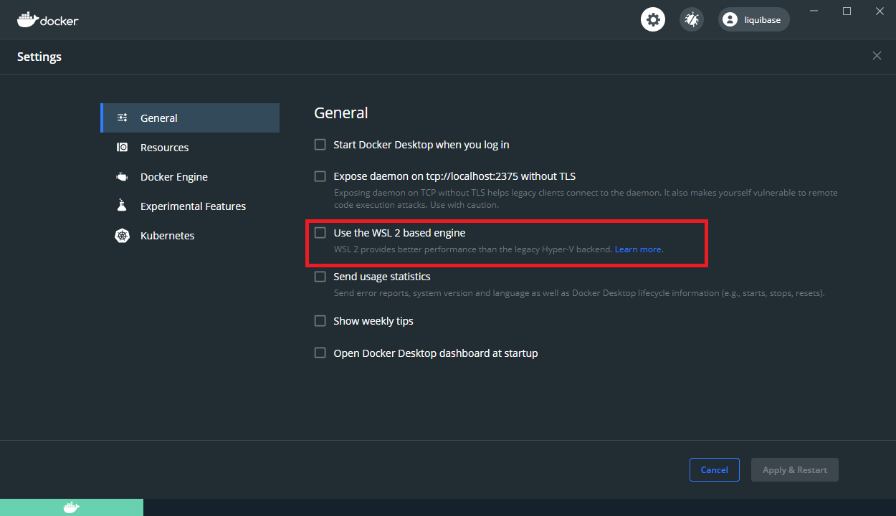
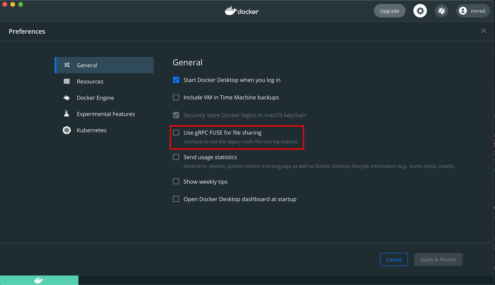

# Session 1: Setup and your first data versioning exercise

Over the next hour, you will configure your computer to begin versioning a database in a container. 

> For assistance, questions, or comments, please contact us via [Discord.](https://discord.gg/NVpqM7nNnT)

> After completing the Session, please provide feedback [here.](https://forms.gle/6XSpqG7WrRsCNTrh7)

# Install Docker, Liquibase, and Liquibase Data Extension 

**IMPORTANT NOTES**

- Be aware that if you uninstall your current version of Docker to reinstall, the uninstall process will remove your images and volumes on your machine.

## Step 1: Install Docker Desktop Community

Download and install the latest version of [Docker Desktop Community.](https://www.docker.com/products/docker-desktop)

> If you have previously installed Docker, verify that you are running 3.2.0 or higher. We have tested and require usage of Docker Desktop Community 3.2.0 or higher for this Beta. This includes the latest version, 3.6.0.

**SYSTEM SPECIFIC SETUP**

- On **Windows**, disable "Use the WSL2 Based Engine" in your Docker settings on Windows. We currently do not support Docker running via WSL2. You can always change this setting back later.



- On **Mac**, disable "Use gPRC FUSE for file sharing". 



## Step 2: Install Liquibase 4.4.3

Liquibase can be downloaded from [here.]( (https://github.com/liquibase/liquibase/releases/tag/v4.4.3)). If you have previously installed Liquibase, verify that it is version 4.4.3 using `liquibase --version`.

> If Liquibase is not currently on your system path, please add it.

Note: The Liquibase Data extension is certified for Liquibase 4.4.3.

## Step 3: Download Liquibase Data extension and add to your system path.

1. Download the latest [Liquibase Data extension.](https://github.com/liquibase/liquibase-data/releases) 
2. Copy the `liquibase-data` jar file to `LIQUIBASE/lib`.
3. Run `liquibase data install`.
4. Run `docker ps`.
>You will see two containers (titan-docker-server and titan-docker-launch) running. Make sure they are ‘running’ and not ‘restarting’.

> For assistance, questions, or comments, please contact us via [Discord.](https://discord.gg/NVpqM7nNnT)


> Mac will require you to go to Security & Privacy settings and allow the downloaded Liquibase Data extension to be accessed.

# Create a local repository for your versioned database

## Step 1: Install the PostgreSQL JDBC Driver

1. Download PostgresSQL JDBC Driver from [here](https://repo1.maven.org/maven2/org/postgresql/postgresql/42.2.18/postgresql-42.2.18.jar)
2. Copy the JAR file to your `liquibase/lib` directory.

NOTE: [Liquibase Package Manager](https://github.com/liquibase/liquibase-package-manager) is an easy way to download and install Liquibase drivers and extensions for platforms like Snowflake, MongoDB, and others.

## Step 2: Create a liquibase.properties

Using a text editor, create a `liquibase.properties` file with the contents below.The `liquibase.properties` file allows Liquibase to communicate with your new versioned database.

    driver: org.postgresql.Driver
    url: jdbc:postgresql://localhost:5432/postgres
    username: postgres
    password: secret
    changeLogFile: changelog.xml
    repository: myrepos

NOTE: The repository name can be anything you would like. For the following steps, we will use myrepos. By specifying in your liquibase.properties, you will not have to use the required argument `--respository=myrepos`. 

## Step 3: Create a new data repository from a blank Docker database

Think of this step as your `git init` for the versioned database. The following command will start a PostgreSQL Docker container and allow Liquibase Data to manage versions for the container. 

> Your repository name can be anything you would like. We are going to use `myrepos`. Feel free to change that to whatever you would like!

Execute this command: 

    liquibase data run --name=myrepos --env=POSTGRES_PASSWORD=secret --image=postgres

NOTE: The `--name` argument should match the repository name you listed in `liquibase.properties`.


Verify the repository exists by executing this command:

    liquibase data ls

## Step 4: Commit your empty database to the repository

On your first commit, you will be committing an empty database and creating a baseline for your future commits. When creating commits, liquibase data will use your git configuration to determine the name and email address to use by running `git config user.name` and `git config user.email`. If you have not configured git before, you can run `git config --global user.name <name>` and git `config --global user.email <email>` to set these values.

Execute this command: 

    liquibase data commit --message="First commit"

Verify the commit was successful by executing this command:

    liquibase data log

## Step 5: Generate a changelog

Liquibase changelog files are used by Liquibase to make change to your database. Execute this command to an empty changelog file:

    liquibase data generate-changelog --target-db=myrepos

NOTE: This command is very similar to `liquibase generate-changelog`. Since we set up `liquibase.properties` earlier, we would get the same results. However, you can also use `liquibase data generate-changelog --target-db=myrepos --target-state <commit id>` to have Liquibase Data generate a changelog from a specific commit id. Liquibase Data will 

Review `changelog.xml`. It should be empty except the `databaseChangeLog` XML tag.

## Step 6: Add a new changeset to changelog.xml

Now that you have a changelog.xml file, you need to add some changes for Liquibase to make. Add the following changeset to your new changelog.xml. Remember to properly close the `databaseChangeLog` tag after adding this new changeset.

```
<changeSet author="author_name" id="1">
    <createTable tableName="customer">
        <column name="id" type="INTEGER">
            <constraints nullable="false" primaryKey="true" primaryKeyName="customer_pkey"/>
        </column>
        <column name="first" type="VARCHAR(150)"/>
        <column name="middle" type="VARCHAR(150)"/>
        <column name="last" type="VARCHAR(150)"/>
    </createTable>
</changeSet>
```
NOTE: Liquibase will prompt you for an email address to see the report in Liquibase Hub. We will never sell your data.

## Step 7: Persist your Liquibase changes to the database

Now, you will persist the new changeset to your soon-to-be versioned database.

Execute this command: 

    liquibase update

## Step 8: Commit your Liquibase update

After changing your database, create a new commit.

    liquibase data commit --message="Created new table"

## Step 9: Verify that you have new commits.

Just like with `git`, you can review previous changes to your database. 

Execute this command: 

    liquibase data log 

## Step 10: Rollback to previous commit

You can rollback to previous commits easily. You will need the first commit id. That is listed with the previous command, `liquibase data log`

Execute this command: 

    liquibase data checkout --commit=<commit id> 

## Step 11: Connect to the database using a tool like DBeaver to verify that no tables exist.

Of course, seeing is believing. Using your favorite database tool (We like DBeaver!), connect to your database and verify that there are no objects.

> Use the connection information listed in your `liquibase.properties` file to connect to the database.

## Step 12: Get the most recent commit from the repository

Once you have seen the initial database version, checkout the latest commit to see your changes. You should now see a single table in your database tool.

You will need the second commit id. That is listed with the previous command, `liquibase data log`

Execute this command:

    liquibase data checkout --commit=<commit id>

## Step 13: Connect to the database using a tool like DBeaver to verify the Liquibase changes are on the database server

As in Step 11 where you verified the database is empty, you will verify your new table exists in the database.

> Use the connection information listed in your `liquibase.properties` file to connect to the database.

## Step 14: Provide feedback on your experience.

Visit [here](https://forms.gle/6XSpqG7WrRsCNTrh7) to provide feedback.

You can also find us on [Discord](https://discord.gg/NVpqM7nNnT) in #beta-release or DM Robert Reeves (r2liquibase#9789) to schedule time to discuss your experience.

## Step 15: Continue onto Session 2

Session 2 can be found [here.](session-2.md)
